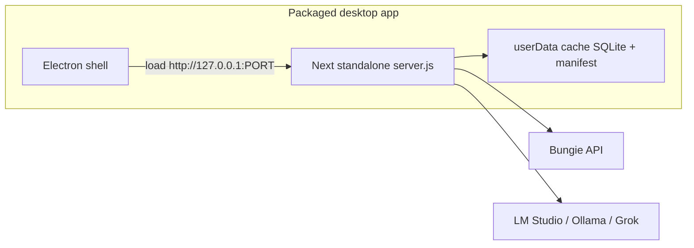

# Desktop packaging research (Windows-first)

**Status**: Research complete — v1 direction locked  
**Updated**: 2026-07-14  
**Audience**: Non-technical friends (double-click installer); Windows primary, Mac/Linux phase 2

## Verdict

Ship Destiny2BuildCreator as an **Electron thin shell** that spawns a **Next.js `output: 'standalone'` Node sidecar**. Do **not** load `better-sqlite3` inside Electron’s Node ABI. Use **electron-builder NSIS** for the Windows installer. Treat Docker and portable zip as documented alternatives only.



## Options compared

| Approach | Non-tech UX | Stack fit | Verdict |
| --- | --- | --- | --- |
| **Electron + Next standalone sidecar** | Excellent (NSIS, Start Menu) | Strong — server keeps its own Node ABI | **v1** |
| **Tauri + Node sidecar** | Excellent (smaller shell) | Viable; still ships Node + native sqlite | Secondary if Electron size is unacceptable |
| **Next inside Electron main** | Same UX | High risk (sqlite ABI / Next 16 hashed externals) | **Avoid** |
| **Docker Desktop** | Poor for friends | Fine for developers | Document only |
| **Portable zip + bundled Node + launcher** | OK | Viable fallback if Electron spike fails | Fallback |
| **Static / serverless host** | N/A | Incompatible with file SQLite + Node APIs | Out of scope |

## Architecture (v1)

1. `next build` with `output: 'standalone'` produces `.next/standalone/server.js`.
2. Packager copies `public/` and `.next/static/` into the standalone tree (Next does not copy them automatically).
3. Electron main process:
   - Resolves a free (or preferred) loopback port.
   - Sets `D2BC_CACHE_ROOT` to Electron `app.getPath('userData')` (e.g. `%APPDATA%/destiny2-build-creator` on Windows).
   - Loads env/secrets from a user-writable config file next to that data dir (see Product blockers).
   - Spawns `node server.js` with `HOSTNAME=127.0.0.1`, `PORT=<port>`, `D2BC_CACHE_ROOT=<userData>`.
   - Opens `BrowserWindow` to `http://127.0.0.1:<port>` after health check.
   - On quit: SIGTERM/kill the child; never leave an orphan Node server.
4. **Single-process only** — one sidecar per machine profile (matches existing SQLite constraint in [README](../README.md)).

### Why sidecar (not in-process)

Running Next + `better-sqlite3` inside Electron’s embedded Node has caused ABI mismatches and Turbopack hashed-external resolution failures in similar Next 16 apps. Keeping the server on a bundled/plain Node binary avoids rebuilding native modules against Electron’s ABI.

## Cache / data directory

| Mode | Root |
| --- | --- |
| Dev / CLI (`npm run dev`, `npm start`) | `<cwd>/.cache` (unchanged) |
| Packaged desktop | `$D2BC_CACHE_ROOT` → Electron `userData` |

Implementation: [`src/lib/manifest/cachePaths.ts`](../src/lib/manifest/cachePaths.ts) reads optional `D2BC_CACHE_ROOT`. Layout under the root stays `app.db`, `manifest/`, `entities/`, `users/`.

## Spike results

See [Spike checklist](#spike-checklist). Code under [`desktop/`](../desktop/) is the minimal Electron main used for the spike; it is scaffolding for a future release, not a finished installer.

| Check | Result |
| --- | --- |
| `output: 'standalone'` build | **Passed** (2026-07-14, Linux CI agent) via `npm run spike:standalone` — Next 16.2.9 emitted `.next/standalone/server.js` |
| `better-sqlite3` in standalone | **Passed** — native binary at `.next/standalone/node_modules/better-sqlite3/build/Release/better_sqlite3.node`; catalog request created `$D2BC_CACHE_ROOT/app.db` with migrated tables |
| Configurable cache root | **Passed** — unit tests in `cachePaths.test.ts`; sidecar wrote DB only under the override temp dir |
| Electron spawn + ready + shutdown | **Passed** (headless/`xvfb-run`) via `npm run spike:electron` — sidecar on `127.0.0.1:3011`, JSON `ok:true`, port clear after quit (no orphan) |
| NSIS on clean Windows | Outline only (research agent is Linux); see [NSIS smoke plan](#nsis-smoke-plan-windows) |

## Product blockers (decide before release)

### 1. Secrets distribution

Friends cannot be expected to edit `.env.local`. Options:

| Model | Pros | Cons | Recommendation |
| --- | --- | --- | --- |
| **A. Shared Bungie app credentials** shipped in the installer (API key + OAuth client) | Zero setup for OAuth | Client secret is extractable; rate limits shared; Bungie ToS / app abuse risk | Acceptable only for a **private friend circle** with a dedicated Bungie application and monitoring |
| **B. Per-user Bungie app** + first-run wizard | Correct multi-tenant hygiene | Too hard for non-tech users | Reject for v1 friend builds |
| **C. Shared public API key + optional OAuth** | Manifest refresh works; sign-in optional | Import/sync disabled until user configures OAuth | Good default for “browse/generate without account” |
| **D. Cloud LLM key (Grok) in wizard** | Generation without local LM Studio | User pays / brings key; key storage on disk | Offer as Settings path |

**Research default for v1 friend builds:** Model **A + D optional** — ship a private shared Bungie confidential app aimed at `https://127.0.0.1:<fixed-port>/api/auth/callback`, generate a per-install `SESSION_SECRET` on first launch, and let Settings configure LLM (local URL or Grok key). Document that secrets are not public-release safe.

Do **not** commit real secrets to git. Release packaging injects them at build time from a private channel.

### 2. OAuth / HTTPS / port

- Login derives redirect from the request URL ([`src/app/api/auth/login/route.ts`](../src/app/api/auth/login/route.ts)).
- Bungie application registration today documents `https://127.0.0.1:3000/api/auth/callback` and refuses bare `localhost`.
- Packaged `NODE_ENV=production` skips the dev-only HTTPS gate, but **Bungie’s registered redirect must still match** what the app uses.
- **v1 recommendation:** Bind sidecar to a **fixed** loopback port (prefer `3000`; if busy, fail with a clear dialog — do not silently change port without a matching Bungie redirect). Prefer registering **both** `https://127.0.0.1:3000/...` (dev) and, if Bungie allows HTTP for the same app, `http://127.0.0.1:3000/...` for packaged production; otherwise embed a local HTTPS cert in the Electron/Next stack for packaged builds.
- Open product decision: confirm with Bungie app settings whether HTTP loopback is accepted for Confidential apps in production mode.

### 3. External LLM prerequisite

Packaging the UI/server does **not** bundle a model.

| Flow | Needs LLM? |
| --- | --- |
| Manifest refresh, catalog, sets/builds CRUD, inventory sync | No |
| Generator / analyzer LLM passes | Yes — LM Studio, Ollama, or Grok |

Installer / first-run copy must say:

1. Install this app.
2. For AI generation: install LM Studio (or Ollama) **or** paste a Grok API key in Settings.
3. Refresh manifest once (needs network + Bungie API key).

Optional SearXNG remains advanced/optional (Docker); curated meta pack covers defaults.

### 4. Size and updates

- Expect **Electron (~150MB+) + Next standalone + native modules** — rough download **200–400MB** before models.
- Auto-update (electron-updater) is **phase 2**.
- Mac DMG / Linux AppImage: same builder config, separate CI targets — **phase 2**.

## Installer artifacts (planned)

| Platform | Target | Phase |
| --- | --- | --- |
| Windows | NSIS (x64) via electron-builder | **v1** |
| macOS | DMG (arm64 + x64 or universal) | Phase 2 |
| Linux | AppImage (x64) | Phase 2 |

## Spike checklist

Run from repo root after `npm install`:

```bash
# 1) Standalone + sqlite under custom cache root
npm run spike:standalone

# 2) Electron shell (requires: npm i -D electron)
npm run spike:electron
```

Manual Windows NSIS steps: [below](#nsis-smoke-plan-windows).

### Standalone spike expectations

1. `next build` emits `.next/standalone/server.js`.
2. Script copies `public` + `.next/static` into standalone.
3. Starts server with `D2BC_CACHE_ROOT` under a temp dir.
4. Hits a cheap HTTP route and opens SQLite at `$D2BC_CACHE_ROOT/app.db` (via a small Node probe using the same path helper, or by triggering DB init through an API that touches the DB).

### Electron spike expectations

1. Main process spawns the standalone server.
2. Waits until `http://127.0.0.1:PORT` responds.
3. Opens a BrowserWindow.
4. On window-all-closed / before-quit, kills the child and exits cleanly (no orphan `node` listening).

## NSIS smoke plan (Windows)

Perform on a **clean Windows user profile** (or VM) that does **not** have Node/npm installed.

1. On a build machine with Node: `npm ci && npm run build && npm run desktop:dist` (future script wrapping electron-builder `--win nsis`).
2. Copy the generated `dist/*.exe` installer to the clean machine.
3. Run installer; accept defaults (per-user install under `%LOCALAPPDATA%`).
4. Launch from Start Menu.
5. Confirm:
   - Window opens to the app UI (not a blank/error page).
   - `%APPDATA%/destiny2-build-creator/` (or chosen `userData`) receives `.cache` layout / `app.db` after first use.
   - Task Manager shows Electron + one Node child while running; both exit after Quit.
   - Port 3000 conflict: second instance shows a clear error (single-instance lock preferred).
6. Settings → Refresh manifest (network + shipped or configured API key).
7. Optional: LM Studio on `127.0.0.1:1234` → generate once.
8. Uninstall via Windows Apps & Features; confirm Start Menu entry removed. Decide whether to leave `userData` (prefer leave data; document path).

### Phase 2 (Mac / Linux)

- Add electron-builder `mac` / `linux` targets in the same `desktop/` config.
- Sign/notarize macOS builds before sharing outside the team.
- Re-run equivalent smoke: install → launch → cache dir → quit → uninstall.
- CI matrix: `windows-latest` (NSIS), later `macos-latest` / `ubuntu-latest`.

## Fallback if Electron spike fails

1. Portable zip: official Node runtime + standalone tree + `Destiny2BuildCreator.bat` / platform scripts setting `D2BC_CACHE_ROOT` under `%LOCALAPPDATA%`.
2. Still requires a first-run config story for secrets/LLM.
3. Worse “app” feel; use only if Electron packaging is blocked.

## Docker (developers only)

Not for friend deployment. Sketch for maintainers:

- Image runs `node server.js` with a volume on `/data` → `D2BC_CACHE_ROOT=/data`.
- Publish `127.0.0.1:3000:3000`.
- Compose can optionally add SearXNG.
- Document in a future `docs/packaging-docker.md` if needed; out of scope for v1 desktop.

## Code touchpoints

| Path | Role |
| --- | --- |
| [`next.config.ts`](../next.config.ts) | `output: 'standalone'` |
| [`src/lib/manifest/cachePaths.ts`](../src/lib/manifest/cachePaths.ts) | `D2BC_CACHE_ROOT` |
| [`desktop/main.cjs`](../desktop/main.cjs) | Electron main / sidecar lifecycle |
| [`desktop/preload.cjs`](../desktop/preload.cjs) | Minimal preload (isolation) |
| [`desktop/electron-builder.yml`](../desktop/electron-builder.yml) | NSIS / future Mac+Linux targets |
| [`scripts/spike-standalone.sh`](../scripts/spike-standalone.sh) | Standalone + sqlite proof |
| [`scripts/spike-electron.sh`](../scripts/spike-electron.sh) | Electron lifecycle proof |

## Out of scope (this research)

- Finished auto-update pipeline
- Bundling an LLM or model weights
- Production code-signing certificates
- Changing domain BRs beyond documenting open decisions above (no new DBR/BR until secrets/OAuth model is chosen for a real release)

## Success criteria (research phase)

- [x] Written recommendation: Electron sidecar + Windows NSIS as v1
- [x] Spike path for standalone + cache root + sqlite (scripted) — **executed**
- [x] Electron main scaffolding with spawn / window / shutdown — **headless spike executed**
- [x] Mac/Linux called out as phase 2
- [x] Product decisions listed (secrets, OAuth/HTTPS/port, LLM)
